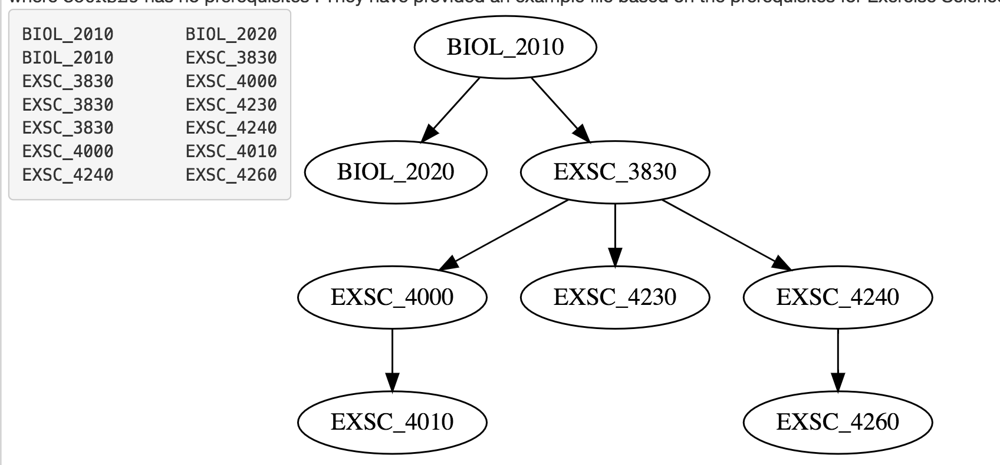
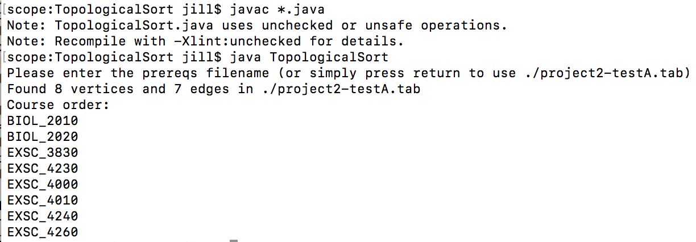

# TopologicalSort
Performs topological sorting of a directed graph using an adjacency list. Test input files are provided and entered at the command line. Files are separated by a tab, and include conditions such as graphs that are disconnected and vertices which have a prerequisite of NONE.  

* Example input file format and respective directed graph

* Program Execution and Results

